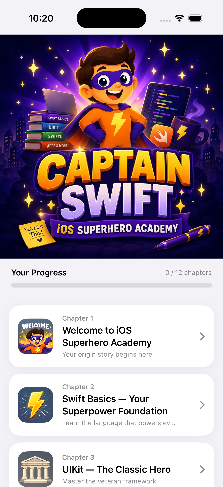
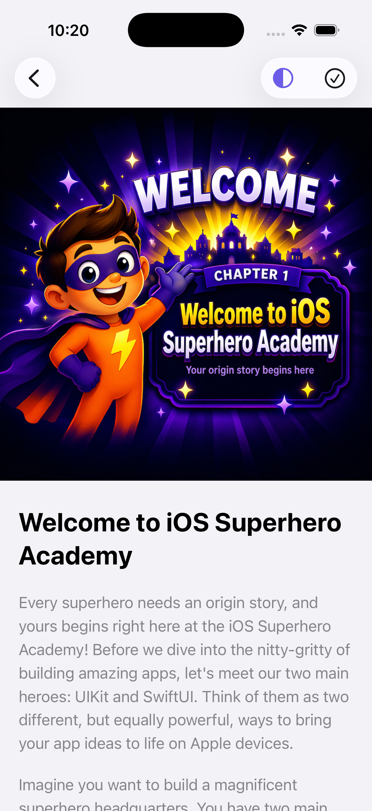
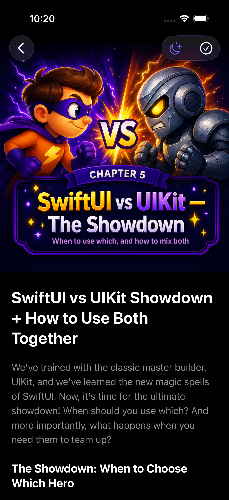
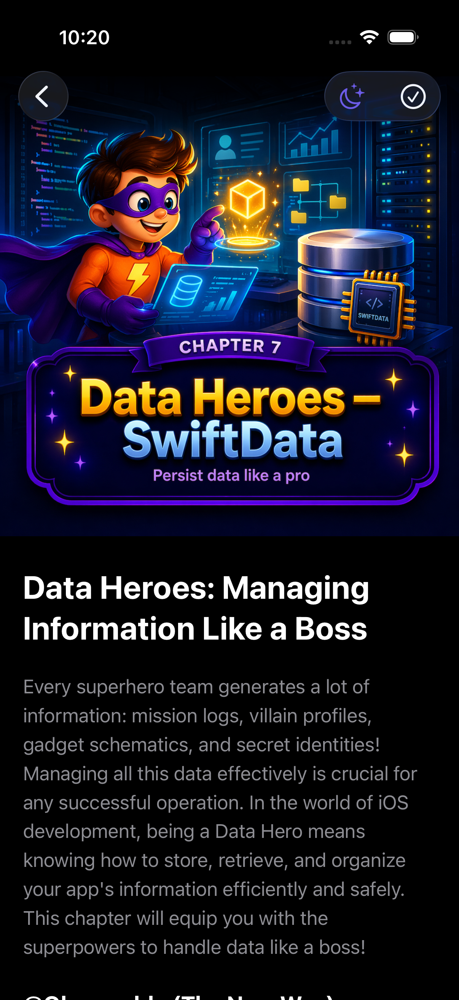

# Captain Swift 🦸‍♂️
### iOS Superhero Academy

> A free, beautifully designed iOS reading app for learning iOS development — from Swift basics to shipping real apps. Built with SwiftUI + UIKit, Captain Swift is itself a showcase of everything it teaches.

<p align="center">
  
  
  
  
</p>

---

## Features

- 📚 **12 structured chapters** — from Swift basics to shipping real apps
- ✍️ **Text highlighting** with 6 colors (Apple Notes style), persisted across sessions
- 🌙 **Reading themes** — System, Light, and Dark mode
- ✅ **Progress tracking** — mark chapters complete, visualized with a live progress bar
- 📱 **iPhone + iPad** — adaptive layout using `NavigationSplitView`
- 💻 **Code blocks** with syntax display and one-tap copy
- ⚡ **Mini challenges** embedded after every section
- 📦 **Fully offline** — no internet, no accounts, no tracking

---

## Screenshots

| Home | Chapter 1 | Dark Mode | Chapter 5 |
|------|-----------|-----------|-----------|
|  |  |  |  |

---

## Tech Stack

| | |
|---|---|
| **Language** | Swift 5.9+ |
| **UI** | SwiftUI + UIKit (`UIViewRepresentable`) |
| **State** | `@Observable` (iOS 17 Observation framework) |
| **Persistence** | `UserDefaults` — highlights & progress |
| **Content** | JSON + Markdown files bundled in app |
| **Architecture** | MVVM |
| **Minimum Target** | iOS 17 |

---

## Project Structure

```
Captain Swift/
├── App/
│   └── Captain_SwiftApp.swift        # Entry point, injects HighlightStore + theme
│
├── Views/
│   ├── Home/
│   │   ├── ContentView.swift         # Root NavigationSplitView (iPhone/iPad)
│   │   ├── HomeView.swift            # iPhone chapter list
│   │   └── SidebarView.swift         # iPad sidebar with chapter grid
│   └── Chapter/
│       └── ChapterView.swift         # Chapter reader, markdown renderer, toolbar
│
├── Highlighting/
│   ├── SelectableTextView.swift      # UITextView wrapper with highlight context menu
│   ├── HighlightStore.swift          # @Observable store, persisted to UserDefaults
│   ├── Highlight.swift               # Codable model (location, length, color)
│   └── HighlightColor.swift          # 6 Apple Notes colors with swatch images
│
├── Models/
│   ├── Chapter.swift
│   ├── Section.swift
│   └── UserProgress.swift
│
├── ViewModels/
│   └── HomeViewModels.swift          # Loads chapter.json, tracks completion
│
├── Design/
│   ├── AppColors.swift               # Brand palette + hex initializer
│   ├── AppFonts.swift                # Typography + spacing/radius constants
│   └── ReadingTheme.swift            # System / Light / Dark enum
│
└── Data/
    ├── chapter.json                  # Chapter metadata, sections, code snippets
    ├── chapter1.md → chapter12.md    # Full markdown content per chapter
    └── MarkdownLoader.swift          # Loads .md files from app bundle
```

---

## Chapters

| # | Title | Topics Covered |
|---|-------|----------------|
| 1 | 🦸 Welcome to iOS Superhero Academy | UIKit vs SwiftUI overview |
| 2 | ⚡ Swift Basics — Your Superpower Foundation | Variables, constants, types, optionals |
| 3 | 🏛 UIKit — The Classic Hero | UIViewController, lifecycle, Auto Layout |
| 4 | ✨ SwiftUI — The New Magic Power | Views, state, bindings, modifiers |
| 5 | ⚔️ SwiftUI vs UIKit — The Showdown | When to use which, bridging both |
| 6 | 🏗 App Architecture — Building the HQ | MVVM, separation of concerns |
| 7 | 🗄 Data Heroes — SwiftData | Persistence, queries, relationships |
| 8 | 🌐 Connecting to the World — Networking | URLSession, async/await, Codable |
| 9 | 🎬 Animations, Gestures & Polish | Transitions, spring animations, haptics |
| 10 | 📱 Building Real Apps | Step-by-step project walkthroughs |
| 11 | 🧪 Testing, Debugging & Performance | XCTest, LLDB, Instruments |
| 12 | 🏆 Becoming the Ultimate iOS Master | What to build next, career advice |

---

## Getting Started

```bash
git clone https://github.com/om-gmd/captain-swift.git
```

1. Open `Captain Swift.xcodeproj` in **Xcode 15+**
2. Select an **iOS 17** simulator or physical device
3. Hit **Run** — no dependencies, no setup, no API keys

---

## Adding or Editing Content

Content is driven by two sources:

**`chapter.json`** — chapter metadata (title, subtitle, emoji, icon, sections with code snippets and challenges)

**`chapter[N].md`** — full markdown content loaded at runtime by `MarkdownLoader`

To add a new chapter, append to `chapter.json` and create the matching `.md` file in the Data folder.

---

## License

MIT License — see [LICENSE](LICENSE) for details.

---

<p align="center">
  Made with ❤️ by <a href="https://github.com/om-gmd">Omar Gyulmamedov</a>
</p>
